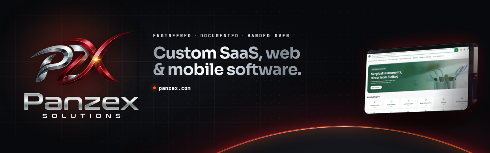

  

<h3 align="center">Custom SaaS, web &amp; mobile software. Engineered, documented, handed over.</h3>

  <a href="https://www.panzex.com">Website</a> ·
  <a href="https://www.panzex.com/showcase">Our work</a> ·
  <a href="https://www.panzex.com/tools">Free tools</a> ·
  <a href="https://www.panzex.com/internships">Internships</a> ·
  <a href="mailto:build@panzex.com">build@panzex.com</a>

---

**Panzex Solutions** is a software development company in Kharian, Pakistan,
building for clients worldwide.

**What we build**

- **Custom SaaS platforms:** multi-tenant architecture, billing, roles and permissions, admin panels
- **Web applications:** dashboards, customer portals, internal tools
- **Mobile apps:** iOS and Android
- **SEO & technical optimisation:** performance, structured data, crawlability
- **UI/UX design & product strategy**

**How we work.** Every project is handed over in full: the code, the
infrastructure, and the documentation of how it all fits together. It's
yours, and it stays maintainable without us.

  <a href="https://www.linkedin.com/company/panzex-solutions">LinkedIn</a> ·
  <a href="https://x.com/panzexsolutions">X</a> ·
  <a href="https://instagram.com/panzexsolutions">Instagram</a>

